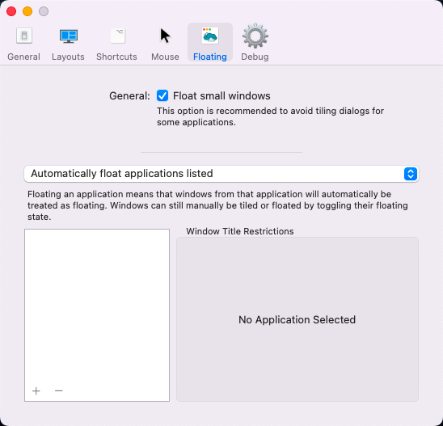

窗口屏幕管理工具

https://github.com/ianyh/Amethyst

Amethyst 使用两个修饰符组合（mod1和mod2），并且可以选择使用另外两个（mod3和mod4）。

**标粗是我常用的**

| 默认快捷方式 | 描述                  |
| ------------ | --------------------- |
| mod1         | option + shift        |
| mod2         | ctrl + option + shift |
| mod3         | 默认情况下未定义      |
| mod4         | 默认情况下未定义      |

并定义了以下命令，主要是到 xmonad 组合键的映射。

| 默认快捷方式     | 描述                                           |
| ---------------- | ---------------------------------------------- |
| mod1 + space     | 向前循环布局                                   |
| mod2 + space     | 向后循环布局                                   |
| mod1 + h         | 缩小主窗格                                     |
| mod1 + l         | 展开主面板                                     |
| mod1 + ,         | 增加主窗格数                                   |
| mod1 + .         | 减少主窗格数                                   |
| **mod1 + j**     | **同一桌面逆时针移动焦点（同桌面）**           |
| **mod1 + k**     | **同一桌面顺时针移动焦点（同桌面）**           |
| **mod1 + p**     | **将焦点移动到逆时针屏幕（多屏幕）**           |
| **mod1 + n**     | **将焦点移至顺时针屏幕（多屏幕）**             |
| **mod2 + h**     | **将焦点窗口扔到逆时针屏幕（多屏幕）**         |
| **mod2 + l**     | **将焦点窗口扔到到顺时针屏幕（多屏幕）**       |
| mod2 + j         | 逆时针交换焦点窗口                             |
| mod2 + k         | 顺时针交换焦点窗口                             |
| **mod1 + enter** | 将焦点窗口与主窗口交换                         |
| mod1 + z         | 强制重新评估窗口                               |
| mod2 + z         | 重新启动紫水晶                                 |
| **mod2 + left**  | **将聚焦的窗口扔到左边的桌面并全屏（多桌面）** |
| **mod2 + right** | **将聚焦的窗口扔到右边的桌面全屏（多桌面）**   |
| **mod2 + 1**     | **将焦点窗口扔到空间 1（多桌面）**             |
| **mod2 + 2**     | **将焦点窗口扔到空间 2（多桌面）**             |
| **mod2 + 3**     | **将焦点窗口扔到空间 3（多桌面）**             |
| **mod2 + 4**     | **将焦点窗口扔到空格 4（多桌面）**             |
| **mod2 + 5**     | **将聚焦窗口扔到空格 5（多桌面）**             |
| **mod2 + 6**     | **将焦点窗口扔到空格 6（多桌面）**             |
| **mod2 + 7**     | **将焦点窗口扔到空格 7（多桌面）**             |
| **mod2 + 8**     | **将焦点窗口扔到空间 8（多桌面）**             |
| **mod2 + 9**     | **将焦点窗口扔到空格 9（多桌面）**             |
| **mod2 + 0**     | **将焦点窗口扔到空格 10（多桌面）**            |
| **none**         | **将焦点窗口扔到空间 11（多桌面）**            |
| **none**         | **将焦点窗口扔到空间 12（多桌面）**            |
| **mod1 + w**     | **对焦屏 1（多屏幕）**                         |
| **mod2 + w**     | **将焦点窗口扔到屏幕 1（多屏幕）**             |
| **mod1 + e**     | **对焦屏 2（多屏幕）**                         |
| **mod2 + e**     | **将焦点窗口扔到屏幕 2（多屏幕）**             |
| **mod1 + r**     | **对焦屏 3（多屏幕）**                         |
| **mod2 + r**     | **将焦点窗口扔到屏幕 3（多屏幕）**             |
| **mod1 + q**     | **对焦屏 4（多屏幕）**                         |
| **mod2 + q**     | **将焦点窗口扔到屏幕 4（多屏幕）**             |
| mod1 + t         | 切换焦点窗口的浮动                             |
| mod1 + i         | 显示当前布局                                   |
| mod2 + t         | 切换全局平铺                                   |
| mod1 + a         | 选择高布局                                     |
| none             | 选择高右布局                                   |
| mod1 + s         | 选择宽布局                                     |
| none             | 选择中宽布局                                   |
| mod1 + d         | 选择全屏布局                                   |
| mod1 + f         | 选择列布局                                     |
| none             | 选择行布局                                     |
| none             | 选择浮动布局                                   |
| none             | 选择宽屏高布局                                 |
| none             | 选择 bsp 布局                                  |

